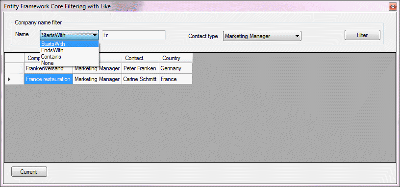

## Comparing SqlClient, EF6, EF Core Like condition

This repository contains basic code to use Entity Framework Core [Functions.Like](https://docs.microsoft.com/en-us/dotnet/api/microsoft.entityframeworkcore.dbfunctions?view=efcore-2.1) extension method in Windows Form projects.



```csharp
public List<CustomerEntity> GetCustomersFilter(LikeOptions pNameCondition, string pName, int pContactType)
{
    var nameFilter = "";
    if (pNameCondition == LikeOptions.StartsWith)
        nameFilter = $"{pName}%";
    else if (pNameCondition == LikeOptions.Contains)
        nameFilter = $"%{pName}%";
    else if (pNameCondition == LikeOptions.EndsWith) nameFilter = $"{pName}%";

    using (var context = new NorthWindContext())
    {
        var customerData = (
            from customer in context.Customers
            join contactType in context.ContactType on customer.ContactTypeIdentifier equals contactType.ContactTypeIdentifier
            join contact in context.Contact on customer.ContactIdentifier equals contact.ContactIdentifier
            where Functions.Like(customer.CompanyName, nameFilter)
            select new CustomerEntity
            {
                CustomerIdentifier = customer.CustomerIdentifier,
                CompanyName = customer.CompanyName,
                ContactIdentifier = customer.ContactIdentifier,
                FirstName = contact.FirstName,
                LastName = contact.LastName,
                ContactTypeIdentifier = contactType.ContactTypeIdentifier,
                ContactTitle = contactType.ContactTitle,
                City = customer.City,
                PostalCode = customer.PostalCode,
                CountryIdentifier = customer.CountryIdentfier,
                CountyName = customer.CountryIdentfierNavigation.CountryName
            }).ToList();

        if (pContactType > 0)
        {
            customerData = customerData.Where(x => x.ContactTypeIdentifier == pContactType).ToList();
        }
        return customerData;
    }
}
```

#### Quirk in EF Core
Seems that System.ComponentModel.Annotations when added automatically the incorrect version is installed. Delete it, add from NuGet if the following exception appears during testing.
>Could not load file or assembly 'System.ComponentModel.Annotations, Version=4.1.0.0

The fix is to install NuGet package [System.ComponentModel.Annotations](https://www.nuget.org/packages/System.ComponentModel.Annotations/4.6.0-preview8.19405.3).
